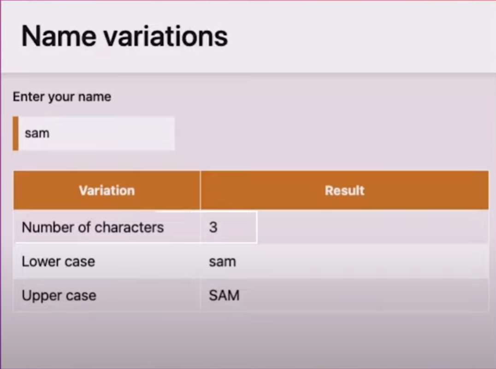

# Projeto 2 - Aplicativo de nomes

Seja bem-vindo! Neste vídeo, vamos conferir o Projeto 2 - Aplicativo de nomes.

Nesse projeto você vai praticar o que aprendeu, criando um `aplicativo de variações de nomes`.

- Quando você insere um nome em um campo de texto, o aplicativo informa quanto carac teres tem a palavra
- Como ela ficaria em maiúscula.
- Como ela ficaria em minúscula.

> Imagem ilustrativa
> 

Construir esse projeto vai permitir que você pratique seus conhecimentos em funções, strings e lógica de programação no geral.

### Está preparado para avançar para o próximo conteúdo?

[x] Sim, estou aprendendo bastante. Vamos em frente!

[ ] Ainda não. Preciso revisar o conteúdo atual.

[ ] Vou avançar, mas não agora. Farei uma pausa pro café :)
