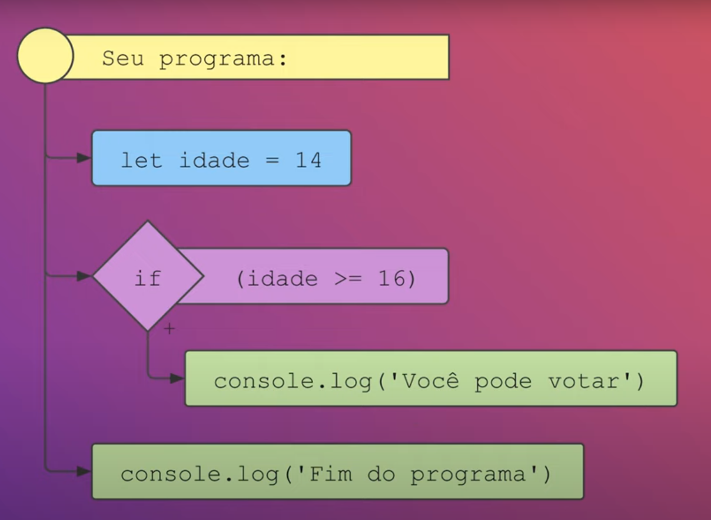

# Ramificações

Seja bem-vindo! Nesta aula, vamos tratar do seguinte assunto: Ramificações

```js
let ano = 2020;
let proximaDecada = ano + 10;
console.log(proximaDecada); // 2030
```

```js
let idade = 14;
if (idade >= 16) {
  console.log("Você pode votar");
}

console.log("Fim do programa");
```

## Ramificação



## Notas

- A `condicional if` permite fazer ramificações no código.
- O código dentro do corpo do if`pode ou não ser executado`, dependendo da condição avaliada pelo if.
