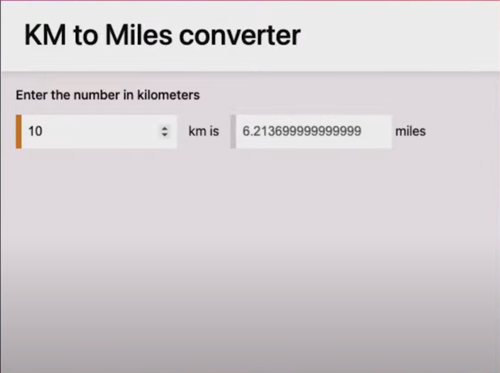
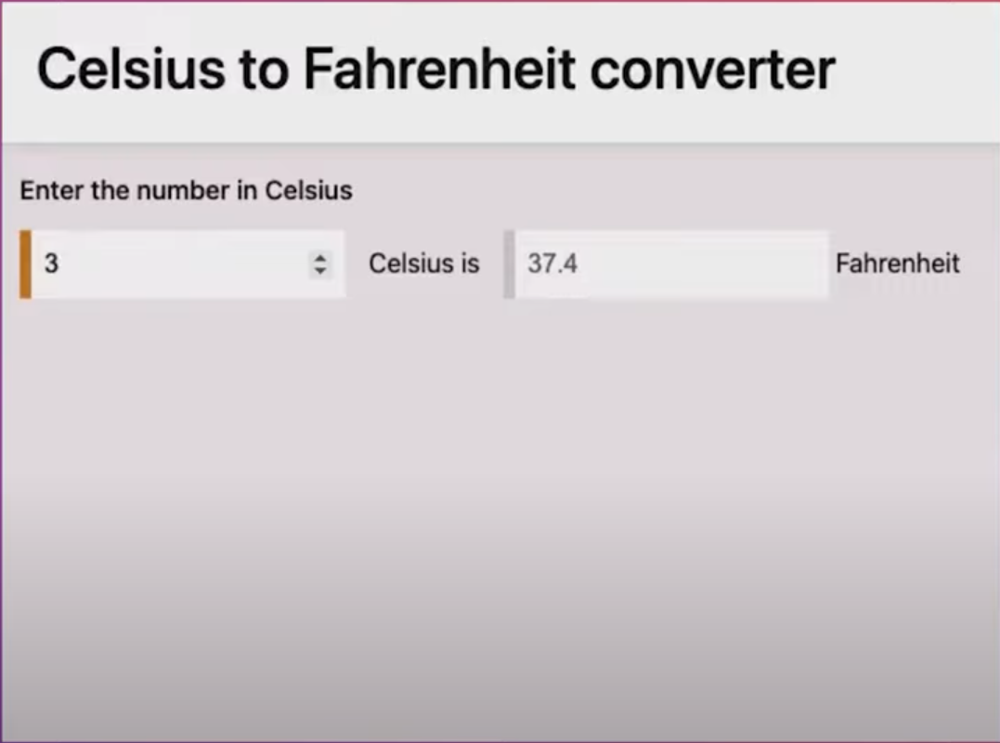

# Projeto 4 - Aplicativo conversor

Seja bem-vindo! Vamos tratar do seguinte assunto: Projeto 4 - Aplicativo conversor.

> Primeiro Projeto: Conversor de KM para Milhas
> 

> Segundo projeto: Conversor de Celsius para Fahrenheit
> 

> Pratique programação nos sites:
>
> - [codepen](codepen.io)
> - [codesandbox](codesandbox.io)
